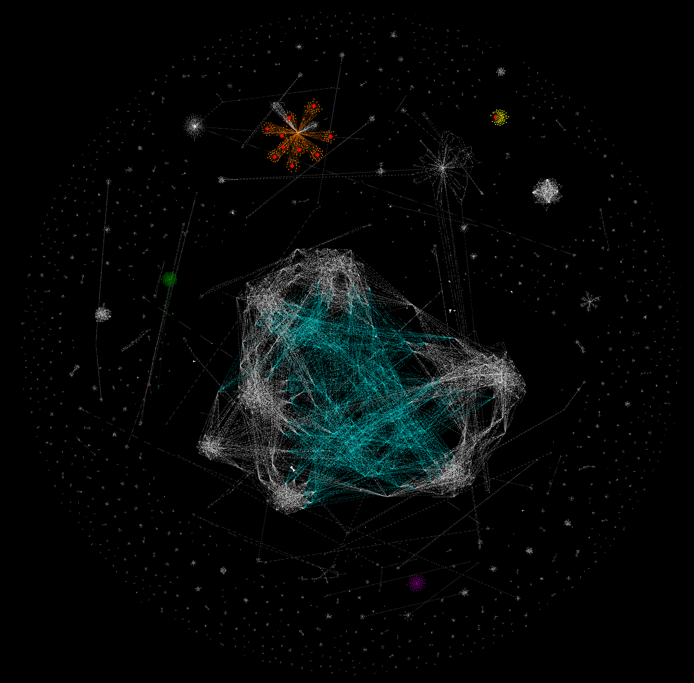

# Detecting users on the Bitcoin network using Machine Learning

This project uses graph databases, machine learning and graph theory to provide a quantitative insight and visual analytics into transactional behaviour on the bitcoin network. This supplements previous work done at the Imperial College London Data Science Institute: https://www.youtube.com/watch?v=E-sQ-UkvH2w&t=3s

The anonymous yet public nature of the Bitcoin blockchain has left many wondering about the inner activities occurring on the network. Breakthroughs in identifying these activities will enable quantitative insights into this massive public database, and help curb the prevailing illicit activities on the system. If this is achieved successfully, public confidence in this currently volatile technology is likely to increase, paving the way for a more stable and widely adopted technology that can change the way the world thinks of money. As a continued step towards this goal, this project builds a framework that takes a combined a top-down and bottom-up approach to analysing the network.

Presented in this study is a novel system that combines machine learning and graph based analysis to extract useful information on real world actors. Given unlabelled address and transaction data, the system is able to cluster addresses belonging to individual users by implementing a refined pair of ownership heuristics. Using these clusters (identified as ‘users’), self defined features are generated and combined with ground truth labels scraped from off-chain sources. By training machine learning models with this feature set, commercial Bitcoin services, such as mining pools, exchanges, gambling sites and tumbling services are identified with high average Recall values of up to 80%. Given enough training data, this system can be utilised to identify services that haven’t been tagged, thereby giving a more encompassing view of network activity. The changing behaviour of services on the network over time is also explored.

Finally, new supplementary top-down visualisations are showcased, adding to previous work done in this space. This study presents the clustering of the address to the user graph in a visual manner. The graphs can be generated for any block height and help derive interesting visual insights that would have otherwise been hidden away. Previous attacks on the network are also explained in the context of these visualisations.

